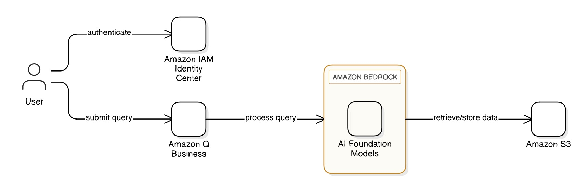

# AI Application for Querying Regulatory Documents
Created by **Ifechukwu Ejiofor** for **AWS Community Day West Africa 2025 Hackathon**

*A simple AI application that can help West African SMEs to easily find out the government regulations that are relevant to their specific business situations*

This application uses AWS services to help businesses (especially SMEs) to find out the permits, licenses, and tax obligations that they need in their places of business and in the industry where they operate in.

To create this application, I obtained regulatory documents from the public websites of regulatory agencies (see [Sources](#sources) below). I stored these regulatory documents in **Amazon S3**. Then, I built an internal representation of these documents using **Amazon Q Business** which, under the hood, runs on **Amazon Bedrock**. I used **Amazon IAM Identity Center** to create users who can access the application.

Below is an architectural diagram that show how all these services work together in my application.



I uploaded a 3-minute video on YouTube demonstrating the application in action. You can watch it [here](https://youtu.be/if7lpR_xp9E).

## How to Run and Test the Application
> **Prerequisites**
> - You must have an **AWS account**  
> - You must enable **IAM Identity Center** in your AWS account (preferably in the `us-east-1` region)
> - You must create at least one user in the **IAM Identity Center** (this user would be used to test the application) 
> - You must create an **Amazon S3 bucket** and upload all regulatory documents from the `/regulatory_docs` folder of this repository into the Amazon S3 bucket
---

1. Clone this repository

2. Replace placeholder values in `config.json`:
    - Replace `<YOUR-IAM-IDENTITY-CENTER-ARN>` with the Amazon Resource Name (ARN) of your IAM Identity Center
    - Replace `<YOUR-ACCOUNT>` with your AWS account ID
    - Replace `<YOUR-S3-BUCKET-NAME>` with your actual S3 bucket name

3. Run the following command, in your command-line interface (CLI), to deploy the application:
```bash
   python deploy_application_for_querying_regulatory_docs.py
```

4. After the deployment is complete, sign in to your AWS console and navigate to Amazon Q Business. You will see the application.

5. Click on the name of the application. Among the details displayed, you will see the URL of the application.

6. Click on the URL of the application. The application will start running!

## List of AWS Tools Used
1. Amazon S3
2. Amazon Q Business
3. Amazon Bedrock
4. Amazon IAM Identity Center

## Sources
1. [Corporate Affairs Commission](https://www.cac.gov.ng/resources/)
2. [Federal Inland Revenue Service](https://firs.gov.ng/tax-resources)
